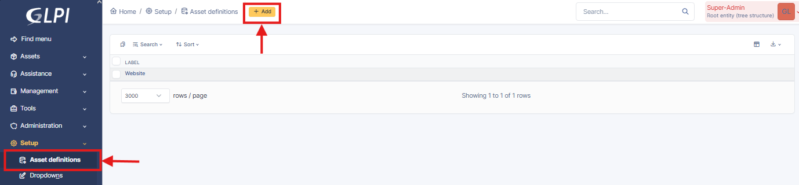
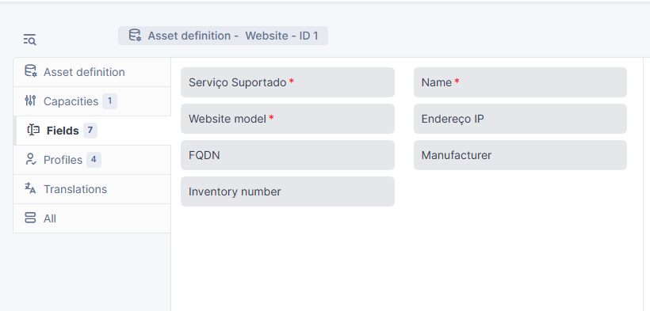

# GLPI 11 – Guia para Criação de Assets Genéricos (Website)

## Enquadramento

Este guia descreve o processo de criação e gestão de **Assets Genéricos ** no **GLPI 11**, com o objetivo de garantir a inventariação consistente de serviços expostos à Internet, a normalização da informação e a conformidade com os requisitos da **CNCS / QNR**.

---

## Pré-requisitos

- GLPI versão **11 ou superior**
- Permissões de administração para **Asset Definitions**
- Estrutura de inventário previamente definida

> [!WARNING]
> A funcionalidade de *Generic Assets* está disponível apenas a partir da versão **GLPI 11**.

---

## Passo 1 – Criar a Definição do Asset “Website”

  
  
  

1. Aceder a **Setup → Asset Definitions**
2. Selecionar **+ Add**
3. Preencher os seguintes campos:
   - **Label:** Website  
   - **System name:** website  
   - **Active:** Yes  
   - *(Opcional)* Selecionar um ícone representativo
4. Clicar em **Add**

  
  
  

---

## Passo 2 – Configurar os Campos (*Fields*)

Após a criação, abrir a definição **Website** e aceder ao separador **Fields**.

O objectivo é manter apenas os campos necessários, alinhados com os requisitos da **CNCS**, garantindo simplicidade e consistência.

### Campos recomendados

| # | Field Label                     | Type            | Observações |
|---|--------------------------------|-----------------|-------------|
| 1 | Nome                           | Text            | Identificação clara do serviço |
| 2 | Serviço Suportado              | Dropdown / Text | e.g. Website Institucional, Portal Académico, VPN Portal |
| 3 | Nome do Software / Equipamento | Text            | e.g. WordPress, Moodle |
| 4 | Modelo / Versão                | Text            | e.g. 6.4.1 |
| 5 | Endereço IP (se aplicável)     | String          | IP público |
| 6 | FQDN (se aplicável)            | URL             | e.g. https://www.exemplo.pt |
| 7 | Fabricante                     | Text / Dropdown | e.g. Open Source, Empresa X |

### Campos a remover

Remover ou desactivar todos os campos que não acrescentem valor para este tipo de asset:
- Status
- Technician in charge
- Inventory
- Campos financeiros ou de ciclo de vida

---

## Passo 3 – Organizar a Ordem dos Campos

Organizar os campos pela seguinte ordem, de acordo com o formato **CNCS QNR**:

1. Serviço Suportado  
2. Nome do Software / Equipamento  
3. Modelo / Versão  
4. Endereço IP (se aplicável)  
5. FQDN (se aplicável)  
6. Fabricante  

  
  
  

No final, clicar em **Save**.

---

## Passo 4 – Adicionar Assets do Tipo Website

1. Aceder a **Assets → Website**
2. Selecionar **+ Add**

> **Nota:**  
> Caso o asset não seja visível, poderá ser necessário terminar sessão e voltar a autenticar-se.

### Exemplo de preenchimento

| Serviço Suportado      | Nome do Software | Modelo / Versão | Endereço IP        | FQDN                 | Fabricante |
|-----------------------|------------------|------------------|--------------------|----------------------|------------|
| Website Institucional | WordPress        | 6.4.1            | 193.136.xxx.xxx    | www.exemplo.pt       | Open Source |

Cada Website exposto à Internet deve ser registado como **um Asset independente**.

---

## Passo 5 – Exportar Assets para a CNCS

1. Aceder a **Assets → Website**
2. Selecionar **Export → CSV**
3. Confirmar que o ficheiro contém **apenas as colunas obrigatórias** definidas pela CNCS

---

## Considerações Finais

Este modelo de Asset permite:
- Inventário normalizado e consistente  
- Facilidade de auditoria  
- Exportação directa para entidades externas  
- Escalabilidade para novos Websites ou serviços web

Qualquer alteração à estrutura deverá ser validada pela equipa responsável pelo inventário ou segurança da informação.
