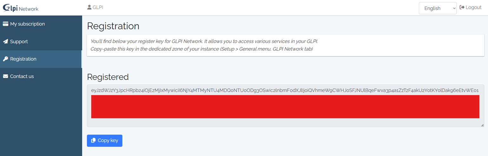
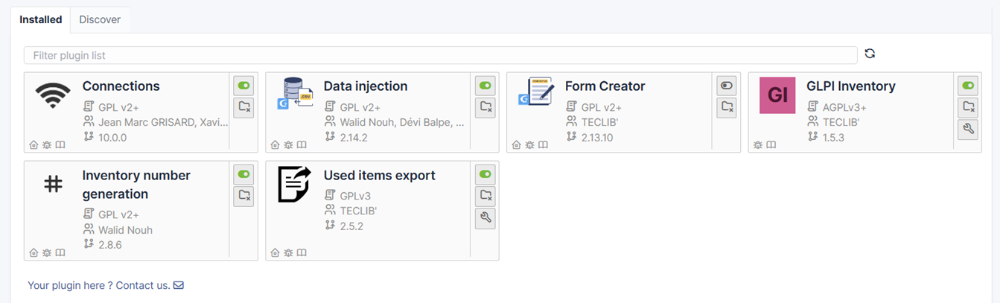

# Plugins Recomendados para Conformidade NIS2

A diretiva NIS2 estabelece requisitos rigorosos ao nível da gestão de ativos, controlo de informação e capacidade de resposta a incidentes.

Neste contexto, o GLPI pode ser complementado com plugins que aumentam significativamente as suas capacidades, permitindo garantir a conformidade com os requisitos de segurança e gestão definidos pela diretiva NIS2.

- Inventário atualizado e centralizado  
- Rastreabilidade de ativos  
- Suporte a auditorias  
- Integração e gestão de dados  

---

## Instalação de Plugins no GLPI

Antes de instalar plugins, é necessário obter acesso ao Marketplace do GLPI.

### Obter chave de acesso (GLPI Network)

1. Aceder ao seguinte link:  
   https://services.glpi-network.com/registration  

2. Criar conta ou efetuar login  
3. Gerar uma **API Key**  

  

A chave gerada permite autenticar o GLPI junto da plataforma GLPI Network, sendo necessária para aceder ao Marketplace e gerir plugins.

---

### Inserir chave no GLPI

No GLPI:

- Ir a **Setup > Plugins**  
- Aceder ao separador **Marketplace**  
- Inserir a **API Key** obtida anteriormente  

Após inserir a chave, será possível pesquisar e instalar plugins diretamente pela interface.

---

## Plugins Recomendados

### Data Injection

Permite importar dados em massa para o GLPI.

**Principais funcionalidades:**
- Importação de utilizadores  
- Importação de ativos  
- Integração com ficheiros externos (CSV, etc.)

**Benefício para NIS2:**
- Garante consistência e integridade dos dados  
- Facilita onboarding de sistemas  

---

### Inventory Number Generation

Gera automaticamente identificadores únicos para ativos.

**Principais funcionalidades:**
- Criação automática de IDs  
- Normalização de inventário  

**Benefício para NIS2:**
- Melhora a rastreabilidade  
- Evita duplicação de informação  

---

### GLPI Inventory

Plugin essencial para recolha automática de informação dos equipamentos.

**Recolhe:**
- Hardware  
- Software  
- Configuração do sistema  

**Benefício para NIS2:**
- Inventário contínuo e atualizado  
- Visibilidade total da infraestrutura  

---

### Used Items Export

Permite exportar informação de ativos e itens.

**Principais funcionalidades:**
- Exportação de dados  
- Geração de relatórios  

**Benefício para NIS2:**
- Suporte a auditorias  
- Facilita reporting e conformidade  

---

## Interface de Plugins no GLPI

  

> [!WARNING]
> Após selecionar um plugin no **Marketplace**, é necessário clicar em **Install** e posteriormente em **Activate** para que o plugin fique operacional no GLPI.
>
> Caso contrário, o plugin ficará instalado mas não ativo, não produzindo qualquer efeito no sistema.

---

## Contributo para a NIS2

A utilização destes plugins permite cumprir vários princípios da NIS2:

- **Gestão de ativos** → inventário completo e atualizado  
- **Rastreabilidade** → identificação única de equipamentos  
- **Monitorização** → visibilidade contínua da infraestrutura  
- **Auditoria** → capacidade de gerar relatórios e evidências  

---

## Relação com requisitos da NIS2

| Requisito NIS2 | Funcionalidade GLPI |
|---------------|--------------------|
| Gestão de ativos | GLPI Inventory |
| Integridade de dados | Data Injection |
| Rastreabilidade | Inventory Number Generation |
| Auditoria e reporting | Used Items Export |

---

****A integração destes plugins no GLPI reforça a capacidade da organização em cumprir os requisitos da diretiva NIS2, garantindo maior controlo, segurança e visibilidade sobre os seus ativos tecnológicos, bem como suporte a processos de auditoria e gestão de risco.****
