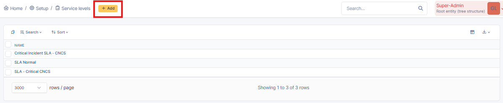
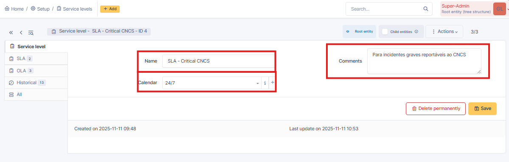
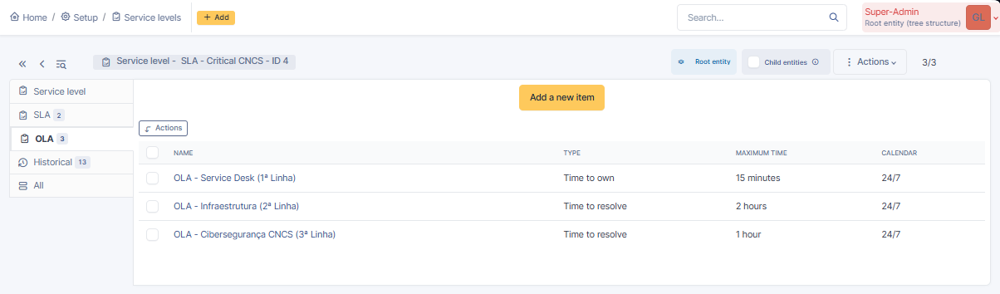
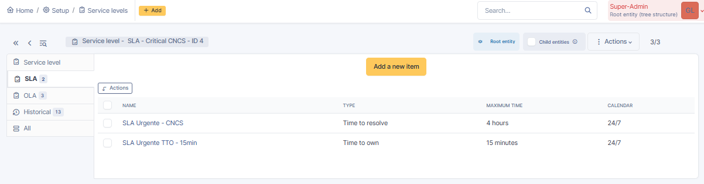
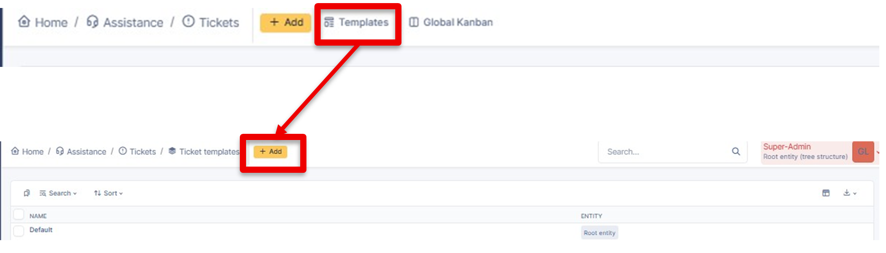
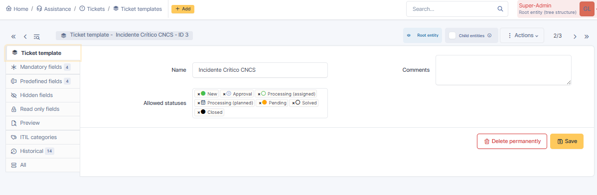
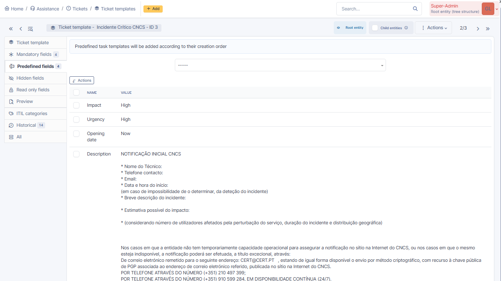
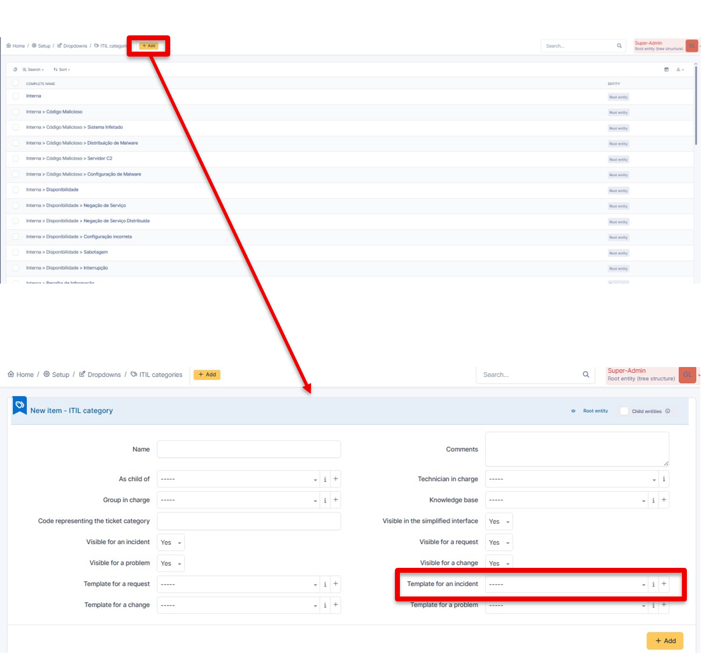

# Guia de Configuração de Automação de Tickets no GLPI

---

## Enquadramento e Objetivo

Este documento é a continuação direta do **Guia de Configuração de Business Rules no GLPI** e descreve o processo técnico necessário para garantir que os tickets seguem automaticamente o fluxo correto após a atribuição da categoria.

O foco deste guia é explicar como a integração entre **Business Rules**, **ITIL Categories** e **Ticket Templates** permite automatizar a classificação, a aplicação de **SLAs** e o enquadramento técnico dos tickets.

---

## Conceito Geral de Funcionamento

A automação no GLPI baseia-se numa cadeia lógica bem definida:

**Business Rule → ITIL Category → Ticket Template → SLA / Fluxo**

As **Business Rules** funcionam como *triggers*, atribuindo automaticamente a categoria correta ao ticket. A categoria já contém a associação ao **Ticket Template** e ao contexto ITIL adequado, permitindo que o fluxo seja seguido automaticamente.

---

## Pré-requisitos Técnicos

Antes de prosseguir, deve estar garantido que:

- As **Business Rules** estão corretamente configuradas e ativas (ver documento “Guia Business Rules GLPI”)
- A estrutura de **ITIL Categories** está definida
- Os métodos de criação de tickets (**Email**, **API**, **Web Interface**) estão funcionais

---

## 1. Criação e Configuração de SLAs

Os **Service Level Agreements (SLAs)** definem os tempos máximos de resposta e de resolução aplicáveis aos tickets, sendo um elemento fundamental para a automação e controlo do serviço no GLPI.

### Passos para criação de um SLA

Após aceder ao menu **Setup → Service levels → SLAs**, deve ser criado um novo SLA através da opção **Add**.

Este ecrã apresenta a lista de SLAs existentes no sistema, permitindo criar novos acordos de nível de serviço ou editar os já definidos.

  
  
  

---

### Definição do SLA (Service Level)

Ao criar ou editar um SLA, devem ser definidos os seguintes parâmetros principais:

- **Nome do SLA**  
  Deve ser claro e identificativo do seu propósito (ex.: **SLA – Critical CNCS**).

- **Calendar**  
  Define o período de contagem do SLA. Para incidentes críticos e reportáveis ao CNCS, recomenda-se a utilização de um calendário **24/7**, garantindo que os tempos são contabilizados continuamente.

- **Comments**  
  Campo opcional, utilizado para documentar o contexto de aplicação do SLA (ex.: “Para incidentes graves reportáveis ao CNCS”).

Esta configuração define o enquadramento geral do SLA, mas não estabelece ainda tempos concretos.

  
  
  

---

### Configuração de OLA (Operational Level Agreements)

Os **OLAs** permitem definir tempos internos por linha de suporte ou equipa, sendo particularmente úteis em cenários com escalonamento técnico.

No contexto apresentado, foram definidos OLAs distintos para diferentes níveis de intervenção, por exemplo:

- Primeira linha (*Service Desk*)
- Segunda linha (*Infraestrutura*)
- Terceira linha (*Cibersegurança / CNCS*)

Cada OLA especifica:

- Tipo de tempo (*Time to own* ou *Time to resolve*)
- Tempo máximo
- Calendário aplicável

Esta separação permite controlar internamente o desempenho de cada equipa, independentemente do SLA global.

  
  
  

---

### Configuração dos tempos de SLA

Na secção **SLA**, são definidos os tempos efetivos que serão aplicados aos tickets.

Para cada entrada de SLA devem ser configurados:

- **Tipo**
  - *Time to resolve* – tempo máximo para resolução do ticket
  - *Time to own* – tempo máximo para atribuição a um técnico ou grupo
- **Maximum time**
  - Ex.: 4 horas para resolução
  - Ex.: 15 minutos para atribuição
- **Calendar**
  - Normalmente alinhado com o calendário definido no SLA principal (ex.: 24/7)

Estes tempos são os que serão referenciados diretamente nas **Business Rules**, sendo automaticamente aplicados aos tickets quando a regra correspondente for acionada.

  
  
  

---

## 2. Criação do Ticket Template

O **Ticket Template** define o comportamento base do ticket no momento da sua criação, permitindo impor campos obrigatórios, valores pré-definidos e texto estruturado, garantindo consistência na recolha de informação e no tratamento dos incidentes.

No contexto deste guia, o Ticket Template é utilizado para normalizar a criação de tickets críticos, assegurando que toda a informação necessária é recolhida desde o início.

### Aceder à gestão de Ticket Templates

Para criar ou gerir Ticket Templates, seguir o caminho:

***Assistance → Tickets → Ticket templates***

Neste ecrã é apresentada a lista de templates existentes, bem como a opção para criação de novos templates.

  
  
  

Após selecionar **Add**, deve ser criado o template com um nome claro e identificativo (ex.: **Incidente Crítico CNCS**).

---

### Allowed statuses

Neste ecrã é também possível definir os **Allowed statuses**, ou seja, os estados em que este template pode ser utilizado/aplicado.

Esta definição é útil para garantir consistência no fluxo de tratamento (ex.: permitir *New*, *Processing*, *Pending* e *Solved*, mas controlar o uso indevido em estados específicos).

  
  
  

---

### Definição dos Mandatory fields

No separador **Mandatory fields**, são definidos os campos obrigatórios do ticket sempre que este template for aplicado.

O objetivo é garantir que:

- o ticket contém informação mínima necessária para ser tratado;
- não existe abertura de incidentes críticos sem dados essenciais;
- a qualidade da informação é uniforme independentemente do utilizador.

  
  
  

---

### Definição dos Predefined fields

No separador **Predefined fields**, são configurados os valores que o GLPI irá preencher automaticamente sempre que este Ticket Template for aplicado.

O objetivo é normalizar a classificação inicial do ticket e reduzir trabalho manual, garantindo que incidentes críticos entram logo com o enquadramento correto (ex.: criticidade elevada, urgência elevada, etc.).

Exemplos de campos frequentemente definidos nesta secção:

- **Impact** (ex.: *High*)
- **Urgency** (ex.: *High*)
- **Opening date** (ex.: *Now*)
- **Status** (quando aplicável ao processo)
- Outros campos relevantes para o teu fluxo (consoante plugins/configuração)

Ao utilizar **Predefined fields**, assegura-se que o ticket fica consistente desde o início, mesmo quando é criado automaticamente por **Email** ou **API**.

  
  
  

---

## 3. Configuração das ITIL Categories

As **ITIL Categories** funcionam como o elemento central de ligação entre as **Business Rules**, os **Ticket Templates** e os **SLAs**.

Neste modelo de automação, as ITIL Categories assumem um papel fundamental, uma vez que são atribuídas automaticamente pelas Business Rules e ativam, de forma indireta, o comportamento definido no Ticket Template.

### Aceder à gestão de ITIL Categories

Para criar ou gerir ITIL Categories, seguir o caminho:

***Setup → Dropdowns → ITIL categories***

Neste ecrã é possível consultar a hierarquia existente e criar novas categorias.

  
  
  

Após a categoria estar criada, deve ser associado o template correspondente:

Template for an incident → Incidente Crítico CNCS

Este é o passo que permite que, quando a categoria for atribuída ao ticket, o GLPI aplique automaticamente o Ticket Template definido.

---

## 4. Business Rules como Triggers do Fluxo

As **Business Rules** são responsáveis por acionar automaticamente o fluxo de tratamento do ticket no momento da sua criação.

Quando uma regra é satisfeita, são executadas ações como:

- atribuição da categoria ITIL correta;
- atribuição do SLA adequado.

Estas ações fazem com que o ticket entre imediatamente no fluxo definido pela categoria, ativando de forma indireta o Ticket Template associado e garantindo o cumprimento dos tempos de resposta e resolução.

A configuração detalhada das Business Rules encontra-se documentada no Guia de Configuração de Business Rules no GLPI, sendo este módulo apenas a sua integração no fluxo global.

---

## 5. Funcionamento do Fluxo Automático

Após a entrada de um ticket:

1. A Business Rule é avaliada
2. A categoria é atribuída automaticamente
3. O Ticket Template associado à categoria é ativado
4. O SLA correspondente é aplicado

O processo ocorre sem necessidade de intervenção manual.

