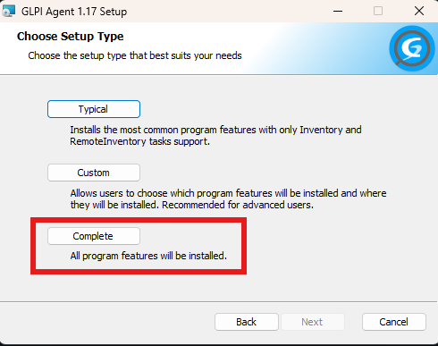
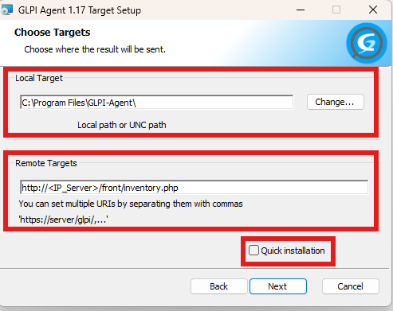
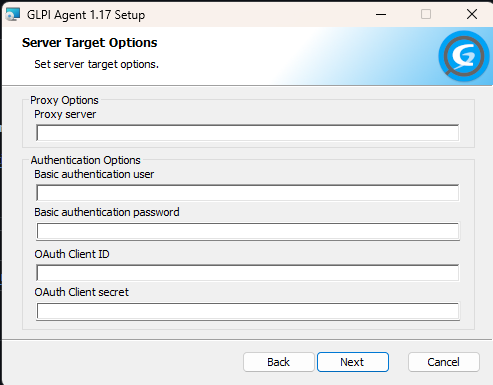
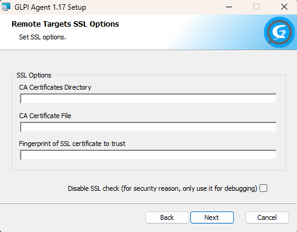
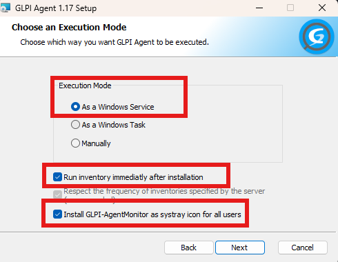
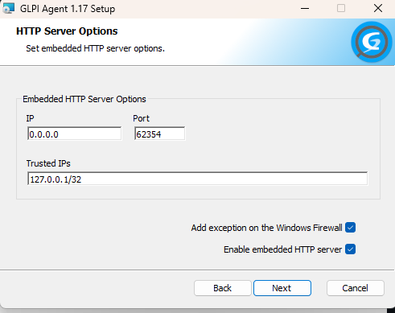
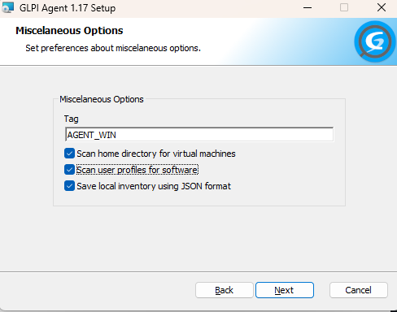
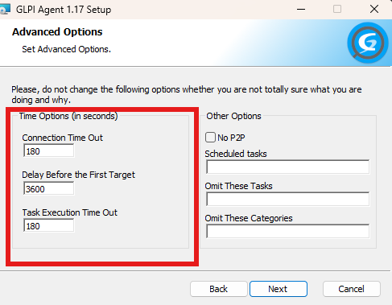
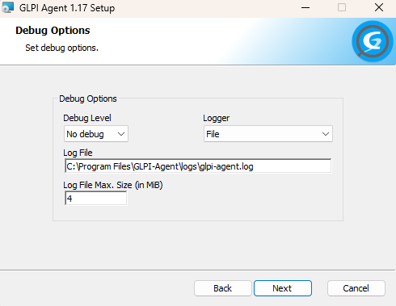
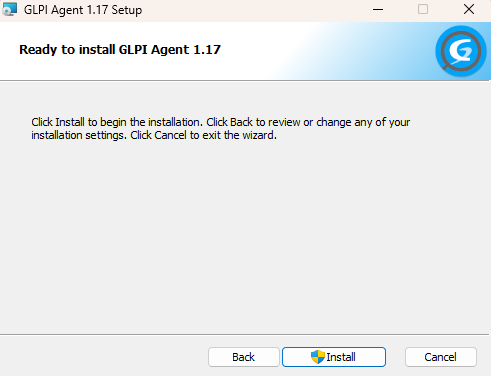

# Guia de Instalação e Configuração do GLPI Agent

## 1. Introdução
Este guia descreve o processo de instalação e configuração do GLPI Agent em sistemas Linux (Ubuntu) e Windows, permitindo a comunicação de inventário com o servidor GLPI.

---

# Linux (Ubuntu)

## 1.2 Requisitos

- Servidor GLPI em funcionamento (testado com GLPI 10.x)
- Inventário ativo:
  - Administration > Inventory > Configuration > Enable Inventory
- Máquina Ubuntu (VM ou física)
- Acesso sudo/root
- Sistema atualizado
- Conectividade de rede entre o agente e o servidor

---

## 1.3 Download do GLPI Agent

Faz o download da versão mais recente do GLPI Agent para Linux a partir das releases oficiais no GitHub:

>[!Warning]
> Confirma sempre se estás a utilizar a versão mais recente disponível no repositório oficial.
> https://github.com/glpi-project/glpi-agent/releases

```bash
wget https://github.com/glpi-project/glpi-agent/releases/download/1.7/glpi-agent-1.7-linux-installer.pl

```
## 1.4 Instalação do GLPI Agent

Tornar o instalador executável e executá-lo com permissões de superutilizador:

```bash
chmod +x glpi-agent-1.7-linux-installer.pl
sudo perl glpi-agent-1.7-linux-installer.pl --type=all
```

> [!NOTE]
> Se pretenderes instalar apenas o módulo de inventário, remove a opção `--type=all`.

Durante a instalação, poderão ser solicitadas as seguintes configurações:

- Diretório de instalação (recomendado manter o padrão)
- Arranque automático do serviço (recomendado: **Sim**)

## 1.5 Configuração do URL do servidor GLPI

Após a execução do comando de instalação, será solicitado que introduzas o URL do servidor GLPI (substituir pelo IP ou hostname do servidor):

```bash
http://<IP_ou_hostname>/front/inventory.php
```

> [!NOTE]
> Se o GLPI estiver instalado numa pasta personalizada (ex: `/var/www/html/glpi/public`), ajusta o caminho conforme necessário.

## 1.6 Verificação do serviço do GLPI Agent

Verifica se o GLPI Agent está a correr como serviço:

```bash
sudo systemctl status glpi-agent
```

- **Active (running)** → o agente está a funcionar corretamente  
- **Inactive/failed** → verificar logs com:

```bash
sudo journalctl -u glpi-agent -e
```
## 1.7 Forçar envio de inventário

Para testar, podes forçar manualmente o agente a enviar o inventário para o servidor GLPI:

```bash
sudo glpi-agent --debug --server http://<IP_ou_hostname>/front/inventory.php --force
```

---

## 1.8 Verificação no GLPI

Acede ao interface web do GLPI.

- Navega até **Assets > Computers**
  - Deverás ver a máquina Ubuntu listada

# Windows

## 2.1 Requisitos

- Servidor GLPI em funcionamento (testado com GLPI 10.x)
- Máquina Windows (Servidor ou Desktop)
  - Permissões de Administrador local
  - Conectividade de rede entre o agente e o servidor

---

## 2.2 Download do GLPI Agent

Faz o download da versão mais recente do GLPI Agent para Windows a partir das releases oficiais:

[Ver releases do GLPI Agent](https://github.com/glpi-project/glpi-agent/releases)

> [!NOTE]
> Confirma sempre se estás a utilizar a versão mais recente disponível no repositório oficial.

Seleciona o instalador adequado ao teu sistema:

- `glpi-agent-x.x-x64.msi` → sistemas 64 bits (mais comum)
- `glpi-agent-x.x-x86.msi` → sistemas 32 


## 2.3 Instalação do GLPI Agent

1. Executa o ficheiro `.msi` descarregado como Administrador.

2. Segue o assistente de instalação:

- Aceitar o contrato de licença  
- Escolher o diretório de instalação (recomendado manter o padrão)  
- Definir o IP/URL do servidor GLPI  


- Selecionar **Install as a Windows Service** (recomendado)  


## 2.4 Configuração do GLPI Agent (Windows)

Durante o assistente de instalação, configura as opções conforme descrito abaixo.

---

### 2.4.1 Tipo de instalação

Seleciona o modo:

- **Complete** — instala todos os componentes do agente, garantindo suporte completo a inventário e funcionalidades adicionais.

Este modo é recomendado para ambientes de produção.



---

### 2.4.2 Target do servidor GLPI

Define para onde o agente irá enviar o inventário:

- **Local Target**: manter o valor por defeito  
- **Remote Target**:

```bash
http://<IP_servidor>/front/inventory.php
```

Este URL corresponde ao endpoint do GLPI que recebe os dados de inventário.

- Não ativar **Quick installation**, para permitir configuração completa.



---

### 2.4.3 Opções de Proxy

Estas opções permitem configurar um servidor proxy para comunicação.

- Em ambientes normais, manter vazio  
- Apenas configurar se a rede exigir proxy para acesso externo



---

### 2.4.4 Opções SSL

Define parâmetros de segurança para ligações HTTPS:

- Manter valores por defeito  
- Não desativar verificação SSL (exceto em ambientes de teste)

Esta opção garante comunicação segura com o servidor.



---

### 2.4.5 Modo de execução

Selecionar:

- **As a Windows Service** — permite execução automática em segundo plano

Ativar:

- **Run inventory immediately after installation** — envia inventário logo após instalação  
- **Install GLPI-AgentMonitor** — adiciona monitor na barra de sistema

Isto garante funcionamento automático e monitorização fácil.



---

### 2.4.6 HTTP Server

Permite ativar um servidor HTTP local no agente.

- Manter configuração por defeito  
- Normalmente não é necessário alterar



---

### 2.4.7 Opções diversas (Misc)

Inclui opções adicionais de comportamento:

- Scan de perfis de utilizador  
- Inventário de software  
- Formato de armazenamento local  

Recomenda-se manter os valores por defeito.



---

### 2.4.8 Opções avançadas

Parâmetros avançados como:

- Timeouts  
- Execução de tarefas  
- Configurações específicas  

Não alterar, salvo necessidade específica.



---

### 2.4.9 Instalação

Após rever todas as configurações:

- Clicar em **Install** para iniciar a instalação



---

### 2.4.10 Conclusão

Finalizar o assistente após a instalação.

O agente deverá iniciar automaticamente e enviar o primeiro inventário.

 
