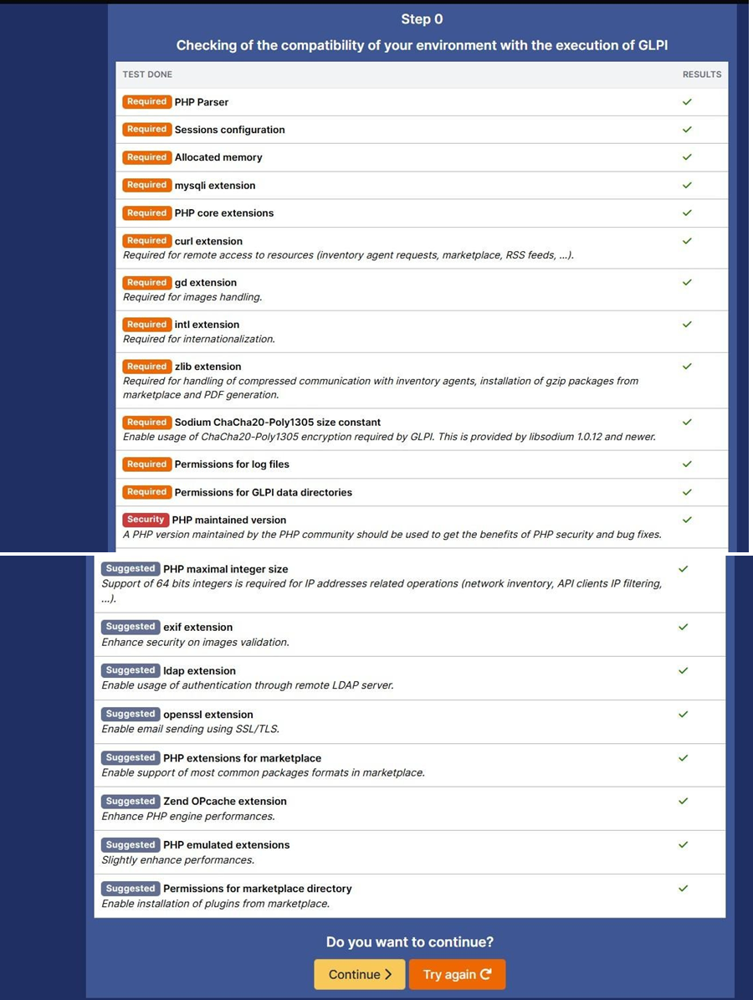
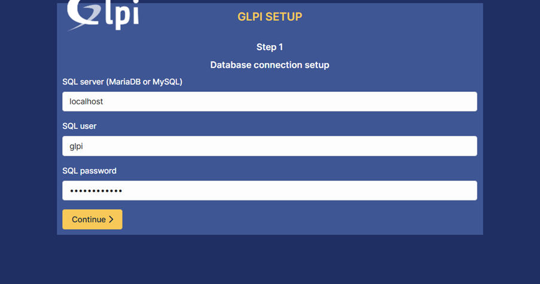

# Instalação do GLPI (Ubuntu Server)

## 1. Objetivo
Este guia descreve o processo de instalação da plataforma GLPI num servidor
Ubuntu Server, incluindo a preparação do ambiente, instalação dos serviços
necessários e configuração inicial da aplicação.

---

## 2. Pré-requisitos
Antes de iniciar a instalação, deverá garantir que:
- Ubuntu Server 22.04 LTS ou superior
- Ligação à Internet
- Acesso root ou sudo
- Conhecimentos básicos de Linux

---

## 3. Atualização do sistema
Antes de iniciar a instalação do GLPI, é fundamental garantir que o sistema
operativo se encontra atualizado. Esta etapa permite corrigir vulnerabilidades,
atualizar dependências e evitar problemas durante a instalação dos serviços
necessários.
Para atualizar a lista de pacotes e aplicar todas as atualizações disponíveis,
executa o seguinte comando:
```bash

apt update && apt upgrade

```


---
## 4. Instalação do Apache, PHP e MariaDB
Para o correto funcionamento do GLPI, é necessário instalar um servidor web,
o PHP (com as extensões recomendadas) e um servidor de base de dados.

Nesta implementação é utilizado:
- **Apache** como servidor web
- **PHP** como linguagem de execução
- **MariaDB** como sistema de gestão de base de dados

  ### 4.1 Instalação do Apache e PHP

Executa o seguinte comando para instalar o Apache, o PHP e as extensões
necessárias ao GLPI:

```bash
apt install -y apache2 php php-{apcu,cli,common,curl,gd,imap,ldap,mysql,xmlrpc,xml,mbstring,bcmath,intl,zip,redis,bz2} \
libapache2-mod-php php-soap php-cas
```
   ### 4.2 Instalação do Apache e PHP
Após a instalação do Apache e PHP, instala o servidor de base de dados MariaDB:
```bash
apt install -y mariadb-server
```
---

## 5. Configuração do MariaDB

Após a instalação do MariaDB, recomenda-se executar o script de segurança para
endurecer a configuração base do servidor de base de dados.

### 5.1 Instalação Segura (secure installation)

```bash
mysql_secure_installation
```

Respostas recomendadas:

- Definir password do utilizador root: Sim (usar password forte)

- Remover utilizadores anónimos: Sim

- Desativar login remoto do root: Sim

- Remover base de dados de teste: Sim

- Recarregar tabelas de privilégios: Sim

### 5.2 Importar informação de fuso horário
 ```bash
mysql_tzinfo_to_sql /usr/share/zoneinfo | mysql mysql
```

## 6. Criação da base de dados e utilizador do GLPI

Nesta etapa é criada a base de dados do GLPI e um utilizador dedicado com as
permissões necessárias.

>[!NOTE]
>Substitui os valores de exemplo (nome de utilizador e password) pelos definidos no vosso ambiente.

Aceder ao MariaDB:

```bash 
mysql -uroot -p
```

Criar base de dados e utilizador (exemplo):

```bash 
CREATE DATABASE glpi;
CREATE USER 'glpi'@'localhost' IDENTIFIED BY 'password_segura';
GRANT ALL PRIVILEGES ON glpi.* TO 'glpi'@'localhost';
GRANT SELECT ON `mysql`.`time_zone_name` TO 'glpi'@'localhost';
FLUSH PRIVILEGES;
EXIT;
```

## 7. Download e preparação do GLPI

Nesta etapa é feito o download do GLPI e preparada a estrutura de diretórios
recomendada (configuração fora da pasta web, e separação de ficheiros/logs).

### 7.1 Download e extração

```bash
cd /var/www/html
wget https://github.com/glpi-project/glpi/releases/download/11.0.0/glpi-11.0.0.tgz
tar -xvzf glpi-11.0.0.tgz
```
### 7.2 Criar o ficheiro downstream.php

```bash
vim /var/www/html/glpi/inc/downstream.php
```

Conteúdo:

```bash
<?php
define('GLPI_CONFIG_DIR', '/etc/glpi/');
if (file_exists(GLPI_CONFIG_DIR . '/local_define.php')) {
    require_once GLPI_CONFIG_DIR . '/local_define.php';
}

```
### 7.3 Mover diretórios (configuração, ficheiros e logs)

Mover a configuração e os diretórios de dados para localizações fora da pasta web:

```bash
mv /var/www/html/glpi/config /etc/glpi
mv /var/www/html/glpi/files /var/lib/glpi
mv /var/lib/glpi/_log /var/log/glpi

```

### 7.4 Criar local_define.php

Criar o ficheiro:

```bash
vim /etc/glpi/local_define.php

```
```bash
<?php
define('GLPI_VAR_DIR', '/var/lib/glpi');
define('GLPI_DOC_DIR', GLPI_VAR_DIR);
define('GLPI_CACHE_DIR', GLPI_VAR_DIR . '/_cache');
define('GLPI_CRON_DIR', GLPI_VAR_DIR . '/_cron');
define('GLPI_GRAPH_DIR', GLPI_VAR_DIR . '/_graphs');
define('GLPI_LOCAL_I18N_DIR', GLPI_VAR_DIR . '/_locales');
define('GLPI_LOCK_DIR', GLPI_VAR_DIR . '/_lock');
define('GLPI_PICTURE_DIR', GLPI_VAR_DIR . '/_pictures');
define('GLPI_PLUGIN_DOC_DIR', GLPI_VAR_DIR . '/_plugins');
define('GLPI_RSS_DIR', GLPI_VAR_DIR . '/_rss');
define('GLPI_SESSION_DIR', GLPI_VAR_DIR . '/_sessions');
define('GLPI_TMP_DIR', GLPI_VAR_DIR . '/_tmp');
define('GLPI_UPLOAD_DIR', GLPI_VAR_DIR . '/_uploads');
define('GLPI_INVENTORY_DIR', GLPI_VAR_DIR . '/_inventories');
define('GLPI_THEMES_DIR', GLPI_VAR_DIR . '/_themes');
define('GLPI_LOG_DIR', '/var/log/glpi');

```

## 8. Definição de permissões

Após mover os diretórios de configuração, dados e logs, é necessário garantir
que o utilizador do servidor web (`www-data`) tem permissões adequadas para
ler e escrever onde o GLPI necessita.

### 8.1 Ownership

```bash
chown root:root /var/www/html/glpi/ -R
chown www-data:www-data /etc/glpi -R
chown www-data:www-data /var/lib/glpi -R
chown www-data:www-data /var/log/glpi -R
chown www-data:www-data /var/www/html/glpi/marketplace -Rf
```

### 8.2 Permissões (ficheiros e diretórios)

```bash
find /var/www/html/glpi/ -type f -exec chmod 0644 {} \;
find /var/www/html/glpi/ -type d -exec chmod 0755 {} \;

find /etc/glpi -type f -exec chmod 0644 {} \;
find /etc/glpi -type d -exec chmod 0755 {} \;

find /var/lib/glpi -type f -exec chmod 0644 {} \;
find /var/lib/glpi -type d -exec chmod 0755 {} \;

find /var/log/glpi -type f -exec chmod 0644 {} \;
find /var/log/glpi -type d -exec chmod 0755 {} \;
```

>[!NOTE]
>Estas permissões são uma base recomendada para garantir funcionamento do GLPI sem expor permissões excessivas.


## 9. Configuração do Apache (VirtualHost)

Para disponibilizar o GLPI via browser, é necessário criar um VirtualHost do Apache
apontado para o diretório `public` do GLPI e ativar as regras de reescrita (rewrite).

### 9.1 Criar o ficheiro `glpi.conf`

```bash
vim /etc/apache2/sites-available/glpi.conf
```

Conteúdo (exemplo):

```bash

<VirtualHost *:80>
  ServerName yourglpi.yourdomain.com
  DocumentRoot /var/www/html/glpi/public

  <Directory /var/www/html/glpi/public>
    Require all granted
    AllowOverride All

    RewriteEngine On
    RewriteCond %{HTTP:Authorization} ^(.+)$
    RewriteRule .* - [E=HTTP_AUTHORIZATION:%{HTTP:Authorization}]
    RewriteCond %{REQUEST_FILENAME} !-f
    RewriteRule ^(.*)$ index.php [QSA,L]
  </Directory>

  ErrorLog ${APACHE_LOG_DIR}/glpi_error.log
  CustomLog ${APACHE_LOG_DIR}/glpi_access.log combined
</VirtualHost>

```

>[!WARNING]
> Substituir yourglpi.yourdomain.com pelo hostname/DNS do vosso ambiente (ou remove a linha ServerName se estiverem a usar apenas IP).


## 9.2 Ativar o site e reiniciar o Apache
```bash
a2dissite 000-default.conf
a2enmod rewrite
a2ensite glpi.conf
systemctl restart apache2

```

## 10. Ajustes de configuração do PHP

Para garantir o correto funcionamento do GLPI (uploads, tempo de execução e limites),
é recomendado ajustar alguns parâmetros no ficheiro `php.ini`.

### 10.1 Editar o ficheiro `php.ini`

```bash
nano /etc/php/8.1/apache2/php.ini
```

## 10.2 Valores recomendados

| Diretiva | Valor |
|---|---:|
| `upload_max_filesize` | `20M` |
| `post_max_size` | `20M` |
| `max_execution_time` | `60` |
| `max_input_vars` | `5000` |
| `memory_limit` | `256M` |
| `session.cookie_httponly` | `On` |
| `date.timezone` | `Europe/London` |

>[TIP]
>No nano, podes usar Ctrl+W para procurar rapidamente uma diretiva (ex.: session.cookie_httponly).


Após aplicar as alterações, reinicia o Apache:

```bash
systemctl restart apache2
```
## 11. Assistente de instalação via Web (Web Installation Wizard)

Abrir um browser e aceder ao GLPI através do endereço do servidor. De seguida, seguir os passos do assistente de instalação.

http://<ip_do_servidor>/

### 11.1 Seleção do idioma

No primeiro ecrã do assistente, seleciona o idioma pretendido e confirma para dar início ao processo de instalação.


### 11.2 Verificação de compatibilidade do ambiente 
Após confirmar o idioma, o GLPI apresenta uma página de verificação automática do ambiente. Nesta etapa são validados os requisitos necessários ao correto funcionamento da aplicação, incluindo versões do PHP, extensões obrigatórias, permissões de diretórios e configurações de segurança.

Caso todos os testes sejam concluídos com sucesso, é possível prosseguir com a instalação. Se algum requisito falhar, deverá ser corrigido antes de continuar.



### 11.3 Configuração da base de dados

Neste passo devem ser introduzidas as credenciais da base de dados criadas
anteriormente. Na maioria dos cenários, o servidor será `localhost`.

- Servidor SQL (MariaDB/MySQL): `localhost`
- Utilizador: `glpi`
- Palavra-passe: *(conforme definida na criação do utilizador)*
- Base de dados: `glpi`



> [!NOTE]
>  Use the following credentials created earlier on database creation.

| Perfil | Utilizador | Palavra-passe |
|---|---|---|
| Super-Admin | `glpi` | `glpi` |
| Tech | `tech` | `tech` |
| Normal | `normal` | `normal` |
| Post-only | `post-only` | `postonly` |

> [!WARNING]
> Altera as palavras-passe por defeito imediatamente após o primeiro login.
> 
## 12. Checklist pós-instalação

Após concluir o assistente de instalação, recomenda-se validar os seguintes pontos.

### 12.1 Remover o script de instalação

Por motivos de segurança, remove o ficheiro do instalador:

```bash
rm /var/www/html/glpi/install/install.php
```
13.2 Reiniciar o Apache

```bash
systemctl restart apache2
```

### 12.3 Ações recomendadas

Alterar todas as palavras-passe por defeito dos utilizadores do GLPI.

Confirmar permissões e ownership dos diretórios do GLPI.

Validar acesso à interface web e funcionamento geral (login, criação de ticket, etc.).


