# Guideline — Inventário de Ativos no GLPI (Passo a Passo)

Este documento descreve, de forma detalhada e sequencial, o processo de inventário de ativos no GLPI. O objetivo é permitir que qualquer utilizador consiga executar o inventário de forma autónoma, consistente e alinhada com as boas práticas do GLPI.

---

## 1. Preparação inicial do GLPI

Antes de iniciar qualquer processo de inventário automático, é essencial garantir que a estrutura base do GLPI está corretamente definida. Uma má configuração nesta fase pode resultar em ativos mal associados ou informação inconsistente.

### 1.1 Entidades

Aceder a `Administration > Entities` e confirmar que existe uma entidade principal e, se necessário, subentidades. As subentidades permitem separar ativos por departamentos, serviços ou localizações. Recomenda-se ativar a herança de dados quando aplicável.

**Exemplo Prático**  
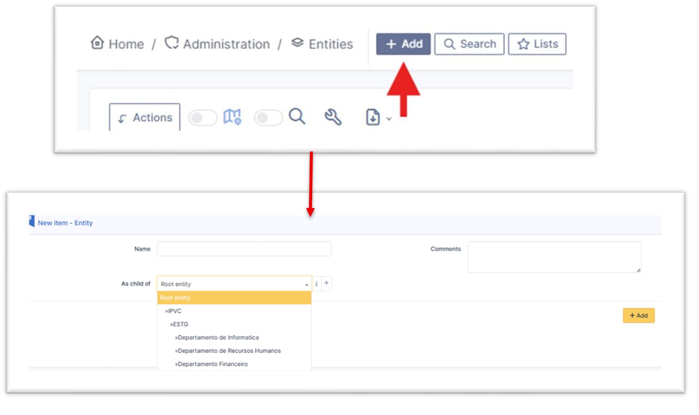

\\\\\\\\\\   
### 1.2 Localizações

Em `Setup > Dropdowns > Locations`, criar uma hierarquia lógica de localizações (ex.: Campus > Edifício > Piso > Sala). Esta informação será utilizada para associar corretamente os ativos.

**Exemplo Prático**  
   

### 1.3 Redes (IP Networks)

Em `Setup > Administration > GLPI Inventory > IP Ranges`, definir as gamas de IP que serão utilizadas nos scans de rede. Cada rede deve conter o endereço base e a máscara correta.

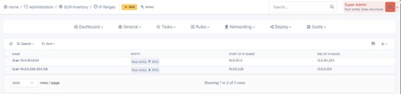   

---

## 2. Ativação do módulo GLPI Inventory

O módulo GLPI Inventory é responsável pela recolha automática de informação dos ativos. Sem esta funcionalidade ativa, o agente não conseguirá enviar dados para o GLPI.

Aceder a `Administration > Inventory` e confirmar que o inventário está ativo e com permissões de envio de dados.

**Nota:** É possível definir a entidade à qual o utilizador pretende definir os ativos.

  
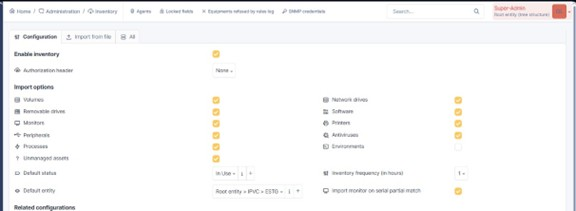   

---

## 3. Instalação e validação do GLPI Agent

O GLPI Agent é o componente que executa localmente os scans e envia os resultados para o servidor GLPI. Deve estar corretamente instalado e em comunicação com o servidor.

Instalar o agente no servidor GLPI ou noutra máquina da rede que tenha acesso às gamas de IP a inventariar. Após a instalação, confirmar no GLPI que o agente aparece registado e ativo.

>[!Warning]
>Em caso de dúvidas, verificar aba sobre instalação do Agente em ambiente Windows ou Linux.

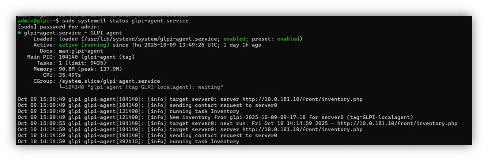  

---

## 4. Criação da Task de Network Discovery

O Network Discovery é o primeiro passo do inventário automático. Este processo permite detetar todos os dispositivos ativos numa determinada rede.

Aceder a `Administration > GLPI Inventory > Tasks > Task management` e criar uma nova task. Atribuir um nome claro e identificável (ex.: Network Discovery – LAN Principal).

>[!Note]
>Recomenda-se ativar a opção **“Permit to re-prepare task after run”**, permitindo reutilizar a task no futuro.

   
 
 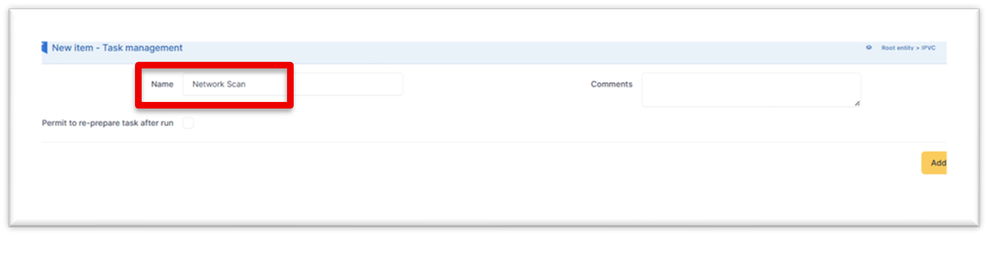 
 
---

## 4.1 Configuração do Job de Network Discovery

Após criar a task, é necessário configurar o Job associado, onde se definem o método de scan, os agentes responsáveis e os alvos (targets).

Em **Job configuration**, criar uma nova ação e selecionar o método **“Network discovery”**. Este método permite identificar dispositivos ativos por IP.

 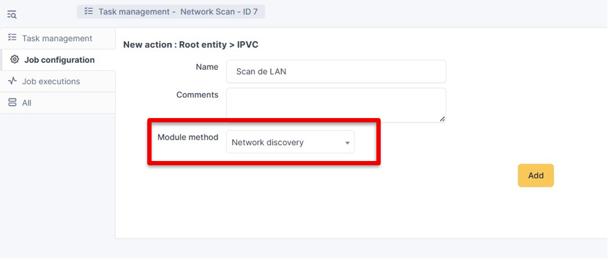 

### Targets e validação do estado

Definir o **Actor (Agente)**, selecionando o agente previamente instalado. O agente é responsável por executar o scan.

 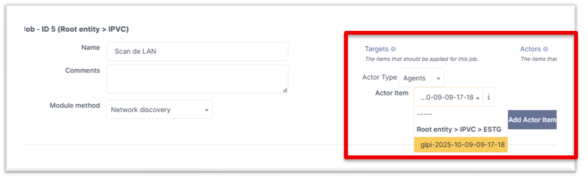 

Definir o **Target (IP Range)**, selecionando a gama de IP criada anteriormente. Após adicionar o target, clicar em **Update** até que o estado fique corretamente associado.

 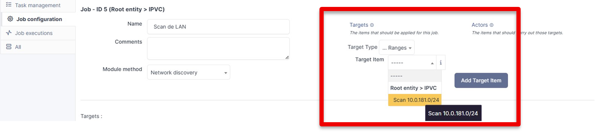 

Depois de adicionar tanto o target como o agent, é necessário clicar em **Update** para que as configurações sejam guardadas e o estado de ambos muda de amarelo para azul, confirmando o sucesso da associação.

  
  
---

## 6. Execução do Network Discovery

Com a task configurada, ativar a opção **Active** (menu inicial), guardar a configuração e iniciar o processo com **Force start**. O estado da task irá evoluir de **Prepared** para **Running**.

 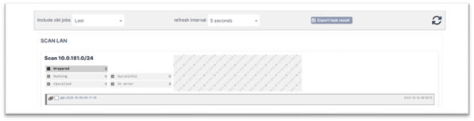 

Quando o processo termina, o estado muda para **Successful** ou **In error**, indicando se o scan foi concluído com sucesso ou se ocorreu algum problema.

 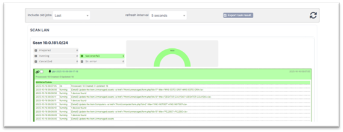 
 
---

## 7. Análise de Unmanaged Assets

Após a execução do Network Discovery, os dispositivos encontrados surgem na secção **Unmanaged Assets**. Estes ativos ainda não fazem parte do inventário principal.

É obrigatório analisar cada ativo e movê-lo manualmente para a categoria correta, como **Network devices** (switches, routers, firewalls) ou **Printers**.

 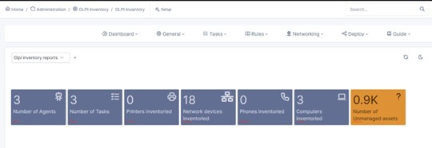 

---

## 8. Inventário detalhado via SNMP

O Network Inventory via SNMP permite recolher informação detalhada dos equipamentos, como interfaces, modelos e contadores. Este passo é opcional mas recomendado para equipamentos de rede.

Criar uma nova ação com o método **“Network inventory (SNMP)”**, definir os targets adequados e executar a task de forma semelhante ao Network Discovery realizado nas etapas acima definidas.

 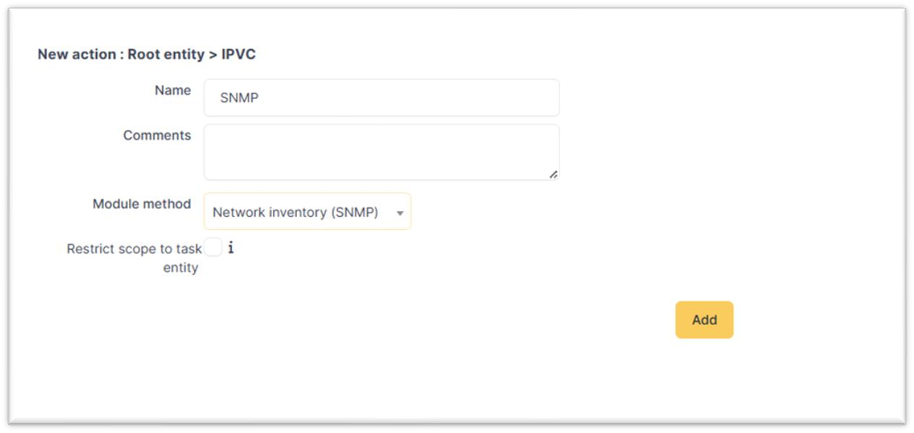 
 
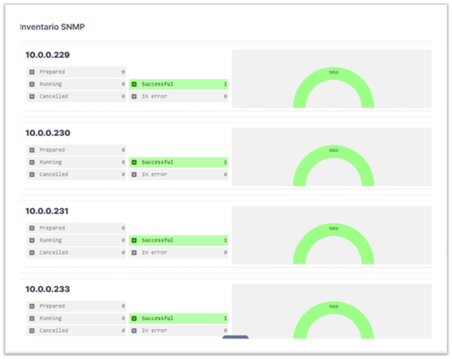 

---

## 9. Validação final

No final do processo, confirmar que os ativos estão corretamente classificados, associados às entidades e localizações corretas, e com informação atualizada.

Este inventário constitui a base para a gestão de tickets, monitorização e relatórios no GLPI.

